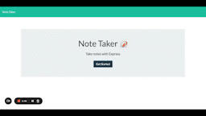

# Note Taker

  

Module 11: Express.js Note Taker Challenge

## Description

Looking for a simple application that allows you to create new notes, save them, view them later and delete? With this simple Note Taker app, you can do all of that! 

Create new notes for tasks in your everyday life, look up previous notes that you have created and delete any notes that you do not want anymore. 

To see some sample notes created using the Note Taker app, click [here](https://kelcie-note-taker-app.herokuapp.com/notes).

## Table-of-Contents 
[Description](#description) -  
[Tutorial](#tutorial) - 
[Deployment](#deployment) - 
[Questions](#questions)

## Tutorial

Below is a demo of how the Note Taker application works! 

## Deployment

Live URL [here](https://kelcie-note-taker-app.herokuapp.com/notes):

GitHub URL [here](https://github.com/kelcmitch97/note-taker):

## Questions

Please contact me using the following links: 

[GitHub](https://github.com/kelcmitch97)

[Email:](kelciemitchelmore@gmail.com) kelciemitchelmore@gmail.com

- - -
© 2021 Trilogy Education Services, LLC, a 2U, Inc. brand. Confidential and Proprietary. All Rights Reserved.
